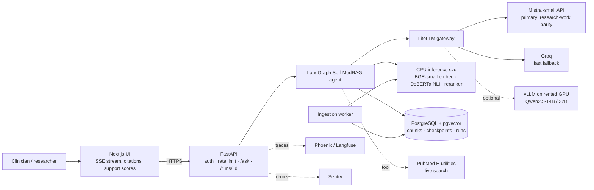

# medical_rag_agent

A cloud-hosted **agentic RAG** service for evidence-grounded medical question answering. It migrates the *Self-verifying Clinical Reasoning in a Loop MedRAG* (Self-MedRAG) research-work prototype off a local NVIDIA Jetson edge device and into the cloud.

The agent retrieves PubMed evidence with hybrid search, generates a JSON answer with a list of rationale statements, and checks each statement against the evidence with an NLI model. When support is too low, it refines the query and tries again.

> ⚠️ **Research use only. Not for clinical decisions.** Answers can be wrong even when they cite sources.

## Status

Early development. The workspace, tooling and the research-work reference data are in place, and the core Self-MedRAG logic (prompts, JSON parsing, BM25 tokenizer, RRF fusion, NLI verification and the loop's stop rules) is ported to `packages/core` and tested against the research-work behaviour. The first milestone is a **parity build** that reproduces the research-work results before any behaviour changes:

| System (research work) | MedQA | PubMedQA |
|---|---|---|
| Self-MedRAG + Mistral-small | 71.30% | 75.96% |

## Origin: the research-work prototype

Before this migration, Self-MedRAG ran as a single-process Python prototype on an edge device. The algorithm was the same (retrieve → generate → NLI-verify → refine), but it was written as a hand-coded loop rather than an agent graph, and it was used from the command line only.

### Previous stack

| Layer | Research-work prototype |
|---|---|
| Hardware | NVIDIA Jetson Orin Nano Super, 8 GB unified CPU/GPU memory (JetPack 6); rented Vast.ai RTX 3090 (24 GB) for the larger-model runs |
| Language / ML runtime | Python 3.10, PyTorch, Hugging Face Transformers, Accelerate, bitsandbytes (4-bit NF4 quantisation) |
| Generator (local) | `Qwen/Qwen2.5-1.5B-Instruct` (4-bit on the Jetson, BF16 on the RTX 3090), `Qwen2.5-7B-Instruct` and `Qwen2.5-14B-Instruct` (4-bit NF4, RTX 3090) |
| Generator (API) | Mistral `mistral-small-latest` via the `mistralai` SDK, with custom retry and back-off |
| Verifier | `cross-encoder/nli-deberta-v3-base`, PyTorch (GPU when memory allowed, otherwise CPU) |
| Dense retrieval | `BAAI/bge-small-en-v1.5` (CLS pooling, 384 dimensions) + FAISS `IndexFlatIP`, cached to disk |
| Sparse retrieval | `rank_bm25` (BM25Okapi, k1 = 1.5, b = 0.75) with a custom medical stopword list |
| Fusion | Reciprocal Rank Fusion (k = 60), top 5 passages |
| Corpus | 10,000 PubMed abstracts (from the 203k-record PubMedQA abstract set), held in memory as plain strings |
| Benchmarks | MedQA (USMLE, 1,000 questions) and PubMedQA (890 questions) |
| Orchestration | Hand-written iterative loop (`Trainer.run()`): support threshold θ = 0.7, up to 3 iterations |
| Configuration | YAML files per experiment, `.env` for keys |
| Interface | CLI scripts and an interactive terminal chat; no API server or UI |
| Operations | Local log files and JSON checkpoints; no containers, IaC or CI/CD |

### Results by generator

| System | MedQA | PubMedQA | Ran on |
|---|---|---|---|
| BM25-only baseline (Mistral-small) | 72.00% | 63.26% | API |
| Dense BGE baseline (Mistral-small) | 72.30% | 79.10% | API |
| Hybrid RRF baseline (Mistral-small) | 71.40% | 76.40% | API |
| Self-MedRAG + Qwen2.5-1.5B | 37.40% | 51.35% | Jetson |
| Self-MedRAG + Qwen2.5-7B (NF4) | 46.20% | 70.22% | RTX 3090 |
| Self-MedRAG + Qwen2.5-14B (NF4) | 59.90% | 75.17% | RTX 3090 |
| **Self-MedRAG + Mistral-small** | **71.30%** | **75.96%** | **API** |

### Why it moved to the cloud

- **Memory limits:** local generators competed with the embedding and NLI models for 8 GB of shared memory, which caused out-of-memory errors, corrupted CUDA contexts, thermal shutdowns and reboots.
- **Accuracy:** the best result came from the API generator, which needs no local GPU at all.
- **Serving:** the prototype was single-user and CLI-only. Serving it to users needs an API, a UI, persistent storage and automated deployment.

## Cloud tech stack

What the migrated service uses.

| Layer | Choice |
|---|---|
| API | FastAPI (SSE streaming) |
| Agent | LangGraph, checkpoints in PostgreSQL |
| LLM | LiteLLM → Mistral `mistral-small-latest` (primary), Groq (fallback) |
| Embeddings | `BAAI/bge-small-en-v1.5`, self-hosted on CPU (ONNX) |
| Verifier | `cross-encoder/nli-deberta-v3-base`, CPU (ONNX int8) |
| Retrieval | PostgreSQL + pgvector (HNSW) + BM25, fused with RRF |
| Frontend | Next.js |
| Infra | AWS (single VM + RDS PostgreSQL), OpenTofu, GitHub Actions, Docker |
| Observability | Sentry, Arize Phoenix |

No component needs a GPU.

## Architecture

### System overview



### Agent workflow

The research-work loop, rebuilt as a LangGraph graph and extended so that the self-verification loop actually iterates when evidence is weak.


### Mapping from the research-work code

File paths refer to the original `self-medrag-production` project.

| Node | Reused from |
|---|---|
| `retrieve_hybrid` | `RetrievalModule.retrieve()` + `fuse_results()` (`src/retrieval.py`); storage moves to PostgreSQL |
| `generate` | `_construct_prompt()` + `_parse_json_output()` (`src/model.py`) + a LiteLLM call |
| `verify_nli` | `verify_and_extract()` (`src/model.py`), extended to also verify the answer |
| decision edge | Stop rules in `Trainer.run()` (`src/trainer.py`): θ, `min_improvement`, `max_iterations`, `max_time_seconds` |
| `refine_query` | `_refine_query()` (`src/trainer.py`): structured, decomposition or concatenation strategy |
| `finalize` | The "best of history" fallback from `Trainer.run()` |
| New nodes | `classify_question`, `grade_retrieval`, `pubmed_search`, safety check, `PostgresSaver` checkpointing |

### Agent state

Fields of the graph state (`TypedDict`): `question`, `question_type`, `options`, `current_query`, `iteration`, `passages[{chunk_id, pmid, title, text, score}]`, `answer`, `rationale[]`, `citations[chunk_id]`, `confidence`, `support_score`, `answer_supported`, `unsupported[]`, `history[]`, `llm_calls`, `started_at`.

## Repository layout

```
packages/settings/    typed runtime settings (pydantic-settings)
packages/core/        framework-free Self-MedRAG logic
packages/agent/       LangGraph agent
apps/api/             FastAPI service
apps/web/             Next.js UI
services/inference/   embedding + NLI service (CPU)
workers/ingest/       corpus ingestion jobs
eval/                 golden sets, reference results, evaluation gate
db/migrations/        Alembic migrations
infra/tofu/           OpenTofu modules and environments
deploy/               Docker Compose and Caddy config
```

## Development

Requirements: [uv](https://docs.astral.sh/uv/) (it installs Python 3.12 for you) and Docker.

```bash
cp .env.example .env      # then fill in MISTRAL_API_KEY, GROQ_API_KEY, HF_TOKEN
make install              # uv sync --all-packages
make hooks                # install pre-commit hooks (ruff, mypy, gitleaks, ...)
make check                # lint + type-check + tests
```


## License

MIT. See [LICENSE](LICENSE).
